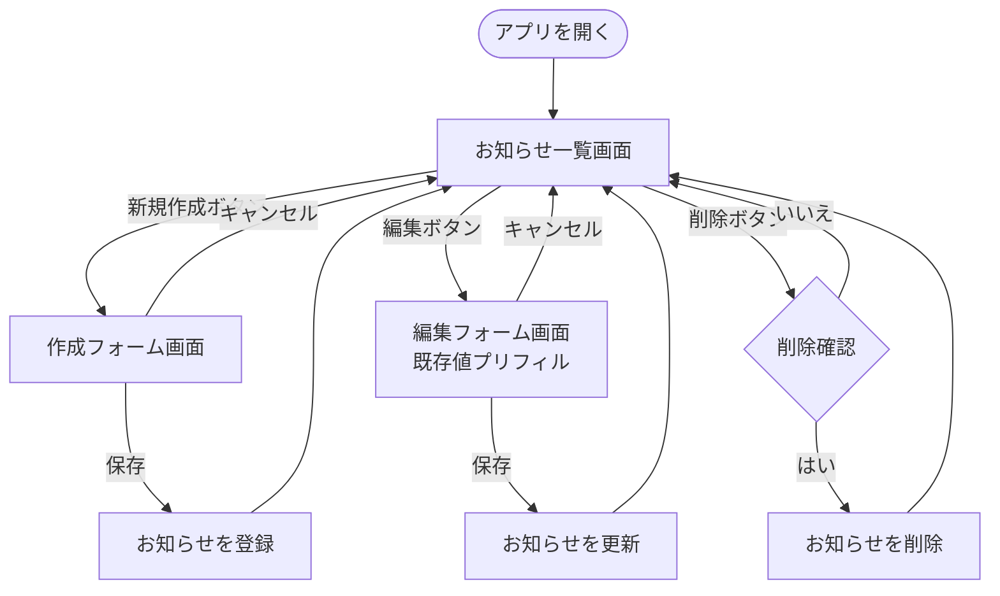

# User Flow — 社内お知らせ掲示板

ユーザー（社内従業員）の主要な操作フロー。 [Q1] [Q2]

## 主要フロー図

テキスト版フロー（図が表示できない環境向け）:
1. アプリを開く → お知らせ一覧画面が表示される
2. 一覧 →「新規作成」→ 作成フォーム → 保存 → 一覧に戻る（新しいお知らせが追加される）
3. 一覧 →「編集」→ 編集フォーム（既存値プリフィル）→ 保存 → 一覧に戻る（更新される）
4. 一覧 →「削除」→ 確認 → はい → 一覧から消える

## 主要ユースケース

| # | ユースケース | 操作 | Source |
|---|------------|------|--------|
| UF-1 | お知らせを閲覧する | アプリを開くと一覧が見える | [Q1] |
| UF-2 | お知らせを投稿する | 新規作成 → 入力 → 保存 | [Q2] |
| UF-3 | お知らせを修正する | 編集 → 修正 → 保存 | [Q2] |
| UF-4 | お知らせを削除する | 削除 → 確認 → 削除 | [Q2] |

## Assumptions & Open Questions

- [assumption] 削除時に確認ダイアログを出す想定（誤削除防止）。詳細は実装時に確定。
