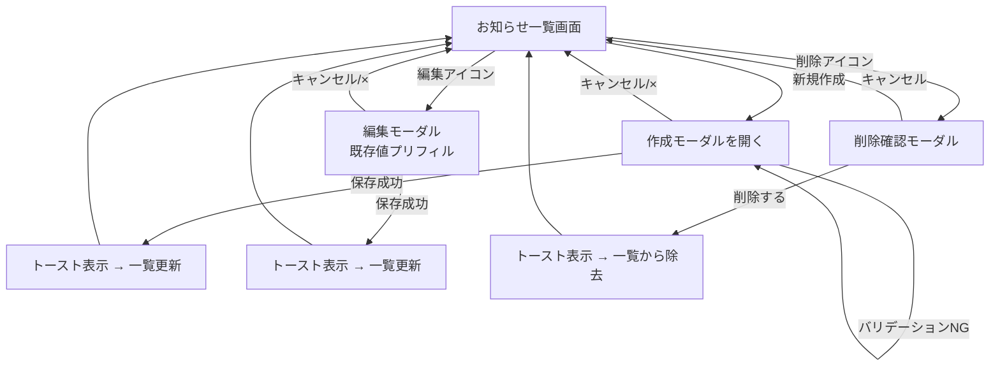

# Refined Mockups — 社内お知らせ掲示板

ロー・ファイデリティのワイヤーフレームを、確定したデザイン判断に基づいて中〜高忠実度に落とし込んだモックアップ。配色・レイアウト・状態・インタラクションを具体化する。 [wireframes] [user-flow] [requirements]

## デザイン判断の前提（確定済み）

| # | 判断 | 選択 | Source |
|---|------|------|--------|
| D1 | 作成/編集フォーム | モーダルダイアログ（一覧の上に重ねる） | [Q1=B] |
| D2 | 削除確認 | モーダル確認ダイアログ | [Q2=A] |
| D3 | デザインする画面状態 | ローディング / エラー / 保存成功 / バリデーションエラー（＋空状態） | [Q3=A,B,C,D] |
| D4 | カテゴリUI | ドロップダウン選択 + 一覧で控えめなバッジ | [Q4=A] |
| D5 | ビジュアルトーン | 情報密度重視・コンパクト | [Q5=C] |
| D6 | レスポンシブ | デスクトップ専用（単一レイアウト） | [Q6=A] |
| D7 | アクセシビリティ | WCAG 2.1 AA 準拠を目標 | [Q7=A] |

## 画面構成

1. **お知らせ一覧画面**（メイン画面、常時表示）
2. **作成/編集モーダル**（一覧の上にオーバーレイ表示） [Q1=B]
3. **削除確認モーダル**（一覧の上にオーバーレイ表示） [Q2=A]

ワイヤーフレームでは作成/編集を別画面としていたが、Q1の判断によりモーダル化。画面遷移をなくし一覧の文脈を保つ。 [wireframes] [Q1=B]

---

## 画面1: お知らせ一覧画面

情報密度重視のコンパクトなテーブル/リスト型レイアウト。1画面で多くの件数を見渡せることを優先する。 [Q5=C]

```
┌────────────────────────────────────────────────────────────────────┐
│  📢 お知らせ掲示板                                   [ + 新規作成 ]  │  ← ヘッダー（banner）
├────────────────────────────────────────────────────────────────────┤
│  カテゴリ │ タイトル              │ 投稿者   │ 投稿日時          │ 操作 │  ← 一覧ヘッダ行
├──────────┼───────────────────────┼─────────┼──────────────────┼──────┤
│ ⬤ 重要   │ システムメンテナンス   │ 山田太郎 │ 2026-10-07 10:30 │ ✎ 🗑 │
│ ○ 一般   │ 歓迎会のご案内         │ 鈴木花子 │ 2026-10-06 15:00 │ ✎ 🗑 │
│ ○ 業務連絡│ 月次報告の提出について │ 名無し   │ 2026-10-05 09:00 │ ✎ 🗑 │
└──────────┴───────────────────────┴─────────┴──────────────────┴──────┘
   ⬤/○ = カテゴリバッジ（控えめな色・形状でも判別可／色のみに依存しない）  [Q4=A]
```

### 要素と役割

| 要素 | 内容 | 備考 |
|------|------|------|
| ヘッダー | タイトル「📢 お知らせ掲示板」+「新規作成」ボタン | `<header role="banner">` |
| 新規作成ボタン | 押下で作成モーダルを開く | 右上固定、主要アクション |
| 一覧（行） | カテゴリ・タイトル・投稿者名・投稿日時・操作 | 投稿日時の降順 [FR1.2] |
| カテゴリバッジ | 控えめな色 + ラベルテキスト（色のみに依存しない） | [Q4=A] [WCAG 1.4.1] |
| 本文プレビュー | 行の下に数行で切り詰め表示（任意、密度優先のため折りたたみ可） | [assumption] |
| 編集アイコン(✎) | 押下で該当お知らせの編集モーダルを開く | aria-label「編集」 |
| 削除アイコン(🗑) | 押下で削除確認モーダルを開く | aria-label「削除」 |

### 空状態（データ0件） [Q3][FR1.1]

```
┌────────────────────────────────────────────────────────────────────┐
│  📢 お知らせ掲示板                                   [ + 新規作成 ]  │
├────────────────────────────────────────────────────────────────────┤
│                                                                      │
│                    📭  まだお知らせはありません                       │
│                 「新規作成」から最初のお知らせを投稿できます           │
│                                                                      │
└────────────────────────────────────────────────────────────────────┘
```

### ローディング状態（一覧読込中） [Q3=A]

```
┌────────────────────────────────────────────────────────────────────┐
│  📢 お知らせ掲示板                                   [ + 新規作成 ]  │
├────────────────────────────────────────────────────────────────────┤
│  ▏▏▏▏▏▏▏▏▏▏  （スケルトン行 × 3〜5。読込中であることを示す）        │
│  ▏▏▏▏▏▏▏▏▏▏                                                        │
└────────────────────────────────────────────────────────────────────┘
   aria-busy="true" / スクリーンリーダーに「読み込み中」を通知  [WCAG 4.1.3]
```

### エラー状態（一覧読込失敗） [Q3=B]

```
┌────────────────────────────────────────────────────────────────────┐
│  📢 お知らせ掲示板                                   [ + 新規作成 ]  │
├────────────────────────────────────────────────────────────────────┤
│  ⚠ お知らせの読み込みに失敗しました。                                │
│     時間をおいて再度お試しください。            [ 再読み込み ]        │
└────────────────────────────────────────────────────────────────────┘
   role="alert" で即時通知。アイコン＋テキストで色のみに依存しない。  [WCAG 1.4.1][4.1.3]
```

---

## 画面2: 作成/編集モーダル [Q1=B]

新規作成と編集を兼ねる。一覧の上にオーバーレイ（背景を暗転）して表示。 [FR2][FR3]

```
      ┌──────────────────────────────────────────────┐
      │  お知らせ作成                            [ × ] │  ← 編集時は「お知らせ編集」
      ├──────────────────────────────────────────────┤
      │  カテゴリ *                                    │
      │  [ 一般            ▼ ]                         │  ← ドロップダウン [Q4=A]
      │                                                │
      │  タイトル *                                    │
      │  [ ____________________________________ ]      │
      │                                                │
      │  投稿者名                                      │
      │  [ ____________________________________ ]      │  ← 任意（未入力時「名無し」） [FR2.4]
      │                                                │
      │  本文 *                                        │
      │  [ ____________________________________ ]      │
      │  [ ____________________________________ ]      │  ← 複数行・改行保持 [FR2.5]
      │  [ ____________________________________ ]      │
      │                                                │
      │                      [ キャンセル ]  [ 保存 ]  │
      └──────────────────────────────────────────────┘
         * = 必須項目（カテゴリ・タイトル・本文）  [FR2.6]
```

### 要素と役割

| 要素 | 内容 | 必須 | Source |
|------|------|------|--------|
| モーダルタイトル | 「お知らせ作成」/ 編集時「お知らせ編集」 | — | [FR2][FR3] |
| カテゴリ | ドロップダウン選択（暫定: 一般/重要/業務連絡） | 必須 | [FR2.6][Q4=A][A3] |
| タイトル | 単一行入力 | 必須 | [FR2.2][FR2.6] |
| 投稿者名 | 単一行入力（未入力時は既定値「名無し」） | 任意 | [FR2.4] |
| 本文 | 複数行テキストエリア（改行保持） | 必須 | [FR2.5][FR2.6] |
| 保存ボタン | 入力を検証し保存、成功で一覧へ反映 | — | [FR2.1][FR3.1] |
| キャンセルボタン | 保存せずモーダルを閉じる | — | [user-flow] |
| 閉じるボタン(×) | キャンセルと同義 | — | — |

編集時は既存値がプリフィルされる。投稿日時は編集で変更しない。 [FR3.3]

### バリデーションエラー状態 [Q3=D][FR2.6]

```
      ┌──────────────────────────────────────────────┐
      │  お知らせ作成                            [ × ] │
      ├──────────────────────────────────────────────┤
      │  タイトル *                                    │
      │  [ ________________________________ ] ⚠        │
      │  ⚠ タイトルを入力してください                   │  ← フィールド直下にエラー文
      │                                                │
      │  本文 *                                        │
      │  [ ________________________________ ] ⚠        │
      │  ⚠ 本文を入力してください                       │
      │                                                │
      │                      [ キャンセル ]  [ 保存 ]  │
      └──────────────────────────────────────────────┘
```

- 必須項目が空のまま「保存」を押すと、各フィールド直下にテキストでエラーを表示（赤枠だけに依存しない）。 [WCAG 3.3.1][3.3.3]
- エラーのあるフィールドに `aria-invalid="true"` と `aria-describedby` でエラー文を関連付け。
- 文字数上限（暫定: タイトル100字 / 本文2000字）超過時も同様にインライン表示。上限値は Functional Design / 実装時に確定（OQ5）。 [open-question]

### 保存中（ローディング）状態 [Q3=A]

```
      │                      [ キャンセル ]  [ 保存中… ⟳ ]  │
```

- 保存ボタンを押下後、ボタンを `保存中…` + スピナーに変え、二重送信を防止（disabled）。 [WCAG 4.1.3]

### 保存成功フィードバック [Q3=C]

```
┌────────────────────────────────────────────────────────────────────┐
│  📢 お知らせ掲示板                           ✓ お知らせを保存しました │  ← トースト
├────────────────────────────────────────────────────────────────────┤
```

- モーダルを閉じ、一覧の上部に数秒間トーストで保存完了を表示。 [Q3=C]
- トーストは `aria-live="polite"` でスクリーンリーダーに通知。 [WCAG 4.1.3]

---

## 画面3: 削除確認モーダル [Q2=A][FR4.2]

```
      ┌──────────────────────────────────────────────┐
      │  お知らせの削除                                │
      ├──────────────────────────────────────────────┤
      │  「システムメンテナンスのお知らせ」を           │
      │  削除します。この操作は取り消せません。          │
      │                                                │
      │                   [ キャンセル ]  [ 削除する ]  │
      └──────────────────────────────────────────────┘
         role="alertdialog" / 初期フォーカスは「キャンセル」側  [WCAG 3.3.4]
```

- 一覧の削除アイコン押下で表示。対象のタイトルを明示し、誤削除を防ぐ。 [FR4.2]
- 「削除する」で確定、一覧から消え、保存成功と同様にトーストで通知。 [FR4.1][Q3=C]
- 「キャンセル」で何もせず閉じる。初期フォーカスは破壊的でない「キャンセル」に置く。 [WCAG 3.3.4]
- 削除成功のトースト例: 「✓ お知らせを削除しました」。

---

## 画面遷移（モーダル版フロー）

ワイヤーフレーム時点の画面遷移を、モーダル方式に更新したもの。 [user-flow][Q1=B]



テキスト版（図が表示できない環境向け）:
1. 一覧 →「新規作成」→ 作成モーダル → 保存 →（成功トースト）→ 一覧に反映
2. 一覧 →「編集」→ 編集モーダル（プリフィル）→ 保存 →（成功トースト）→ 一覧更新
3. 一覧 →「削除」→ 削除確認モーダル →「削除する」→（成功トースト）→ 一覧から除去
4. 各モーダルは「キャンセル」「×」「Escape」で破棄して一覧へ戻る

## Assumptions & Open Questions

- [assumption] カテゴリの暫定区分値は「一般 / 重要 / 業務連絡」。確定は Functional Design / 実装時（OQ2）。
- [assumption] 文字数上限は暫定（タイトル100字 / 本文2000字）。確定は実装時（OQ5）。
- [assumption] 一覧の本文プレビューは密度優先のため折りたたみ可。表示有無は実装時に調整。
- [assumption] 高忠実度モックアップはテキスト/ASCIIベースの記述とし、実画像デザインカンプは本ステージ対象外。
